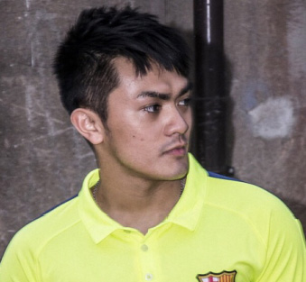
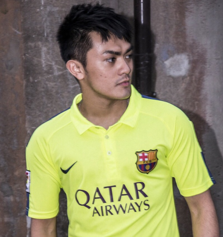

# 版型設計切版(二)_基本框架_2 & 圖片的顯示方法

圖片呢？？？？？？？？？？img/29_版型設計07（請記得換成自己的）.jpg

慢慢開始把選單跟內容的部分都放進去，之後再開始寫細部的樣式


## 左側選單
先看左側選單的部分被我分成三塊

## 第一個區塊
第一個區塊的部分是我們網頁的title的部分，這裡分享兩種方式
很明顯這個區塊有一張圖片跟一串文字是使用 **img** 以及 **span**

> 為什麼不是用p或是h1之類的？

因為我個人習慣字體的大小基本上都會另外調過，
再加上我們有加 **resrt.css** 的關係，所以標題類的大小都變成一般大小了

**img標籤的用法**
```js

```

圖片位置分別有 **絕對位置** 與 **相對位置**
* 絕對位置：就是完整個路徑，死的，假設換了一個資料夾就會整個壞掉（除非你使用的圖片是超連結的）
* 相對位置：就是相對於我們目前的檔案他在哪裡，建議使用任何圖片的時候盡量用相對位置
這邊所使用的圖片位置為相對位置，前面的點的位置為往前一個資料夾的意思，所以兩個點就是往前兩個資料夾


> VS Code 套件推薦(讓選擇檔案位置更方便)
[Path Intellisense](https://marketplace.visualstudio.com/items?itemName=christian-kohler.path-intellisense)

### html
```js
<!-- menu為我們的左側選單框架 -->
<div class="menu">
<!-- 因為這是一個小區塊所以我們也使用一個div來包裹裡面的東西，並且給他一個class樣式方便我們調整-->
  <div class="title">
      
      <span>Peter</span>
  </div>
</div>
```

### 結果

圖片呢？？？？？？？？？？img/30_版型設計08.jpg

圖片顯示但太大張了，所以我們簡單的調整一下大小
先加上一個 class
```js

```

```js
/*這邊將他的層級關係也寫進去，他是在 menu > title底下*/
.menu .title .imgStyle {
     width: 50px;
 }
```

### 結果

圖片呢？？？？？？？？？？img/31_版型設計09.jpg

另一種方式是我們將圖片的部分使用 **css** 的 **background** 屬性

### html
```js
  <div class="menu">
    <div class="title">
      <!--給這個div一個class -> min_picture -->
      <div class="min_picture"></div>
      <span>Peter</span>
    </div>
  </div>
```

看 **html** 目前是沒有任何東西的，讓我們加上style

```js
.menu .title .min_picture {
     background: url('../img/imgTag_un.jpg') no-repeat;
     background-size: 50px auto;
     height: 50px;
     width: 50px;
     display: inline-block;
 }
 ```


**background**：url('圖片位置') **no-repeat** 代表這張圖片不重覆
**background-size**：兩個值分別為 高 寬 我們設定背景圖片大小為 高為50px 寬度自動
**height**：設定高度為50px
**width**：設定寬度為50px

**no-repeat** 也可以獨立設置成 **background-repeat:no-repeat;**
**這邊可以去試試看如果不加寬高的話會發生什麼事**

**display**：專門用來設定區塊屬性的屬性。
因為 **div本身就是一個區塊**，所以它會將文字的部分往下推，
但是我們要讓它們是 **並列的** 所以加上 **inline-block** 這個屬性給它


### 結果

圖片呢？？？？？？？？？？img/32_版型設計10.jpg

這兩種方式的差異有發現到嗎？我個人喜歡第二種方法。
因為只需要去更改 **main.css** 樣式那整個區塊都可以自由去改變，不管是要換哪張圖片還是圖片要移動顯示哪個位置都可以，
但如果使用 **img** 的話，只要改檔案圖片那就必須跟著改，而且必須將圖片的尺寸都設定好，才不會因為設定死的寬高讓它變形。

接下來把這一個區塊的樣子切出來，加入 **title** 這個 class 的樣式。

```js
 .title {
     /*這邊的寬度100%是抓menu設定的寬度*/
     width: 100%;
     /*寫一個適合的高度*/
     height: 100px;
     /*設定底色為#4A4A4A*/
     background-color: #4A4A4A;
 }
```

圖片呢？？？？？？？？？？img/33_版型設計11.jpg

## 第二個區塊
這個區塊就是主要選單的部分，
其實沒有很麻煩，因為節省難度所以設計直式 **單層** 的選單

> Q：什麼是單層?
A：我們網頁通常都會是頁面點擊進去又有一個頁面，那每點擊近一個頁面，我們就叫他一層

### 把以上這個動作定義成一個概念：洋蔥！

這邊選單的部分都是連續且樣式都會是同樣一個區塊，所以我們使用 **ul** **li** 去製作，擺放位置是在 **title** 底下

```js
<div class="menu">
    <div class="title">
        <div class="min_picture"></div>
        <span>Peter</span>
    </div>
    <ul>
        <li>Home</li>
        <li>Pag1</li>
        <li>Pag2</li>
        <li>Pag3</li>
    </ul>
</div>
```

這裡小小提醒，當再次包一層又一層的結構時（不管你在寫什麼語言），
都記得當要再往下縮一層的時候，一定要往內縮一層，這樣可以增加程式的可讀性，
再來是 **class命名** 時都要記得使用 **有意義的名稱**（命名規則在這裡就不細談）

加完 **ul** **li** 來看一下結果

圖片呢？？？？？？？？？？img/34_版型設計12.jpg

有找到奇妙的地方嗎？
我們在前面分享過 **ul** **li**，當時 **ul** 是無序會有小點，那為什麼在這邊沒有呢？
那是因為我們的 **reset.css** 發揮作用囉！
使用 **開發者工具** 點開使用搜尋功能搜尋ul or ol
你會發現它們加了一個屬性 list-style: none;
這代表的意思是已經幫你把標號或是序號通通都拿掉了


## 第三個區塊
主要是用來做 **社群連結** 或是其它網路平台的連結
這裡一樣會使用一個 **div** 來包它，因為這是要用來做連結的所以我使用 **onclick.href** 點擊後會跳到另外我們指定的連結。並運用 **style="cursor:pointer;** 讓滑鼠移過去時顯示 **手的圖示**。

```js
 <div class="menu">
    <div class="title">
      <div class="min_picture"></div>
      <span>Peter</span>
    </div>

    <ul>
      <li>Home</li>
      <li>Page1</li>
      <li>Page2</li>
      <li>Page3</li>
    </ul>

    <div class="link">
      <div class="fb" onclick="location.href='https://www.facebook.com/';" style="cursor:pointer;"></div>
      <div class="github" onclick="location.href='https://github.com/';" style="cursor:pointer;"></div>
      <div class="instagram" onclick="location.href='https://www.instagram.com/';" style="cursor:pointer;"></div>
    </div>

```

```js
.menu .link {
  width: 100%;
  position: absolute;
  left: 0;
  bottom: 0;
}
```

### position：
* 概念：負責用來 **定位** 的，這邊設定的 **absolute (絕對定位)**，意思是根據父層元素來做定位，若外層沒有元素，則依據當前瀏覽器畫面。通常我們使用時常說外相內絕，即是「外層相對定位 包 內層絕對定位」不過其實外絕內絕、外固內絕也是可以的，並沒有一定限制。

* 詳解：代表它是一個孩子，我們要給他一個父親，讓他可以根據父親的區塊範圍定位，也就是相對位置，假如不給他一個父親他會自動認 body 當爸爸，到時候你就會看到區塊在頁面上一直跑在你不要他跑的位置。
他爸是誰？是 menu 哦！他包在 menu 裡面所以 menu 就是爸爸。
left：讓他距離目前的 父親左邊界0px
bottom：讓他距離目前的 父親下邊界0px

接下來這些是社群連結的三張小圖片的 css，這部分與上面放照片的方式一樣就不多做解釋～

```js
/*因為三張圖片的顯示範圍以及區塊模式都是一樣的所以統一寫在div標籤上*/
 .menu .link div {
     height: 20px;
     width: 20px;
     display: inline-block;
 }

.menu .link .fb {
  background: url('../img/facebook-logo.png') no-repeat;
  background-size: auto 20px;
}

.menu .link .github {
  background: url('../img/github-logo.png') no-repeat;
  background-size: 20px auto;
}

.menu .link .instagram {
  background: url('../img/instagram-logo.png') no-repeat;
  background-size: 20px auto;
}
```

### 結果
圖片呢？？？？？？？？？？img/35_版型設計13.jpg
